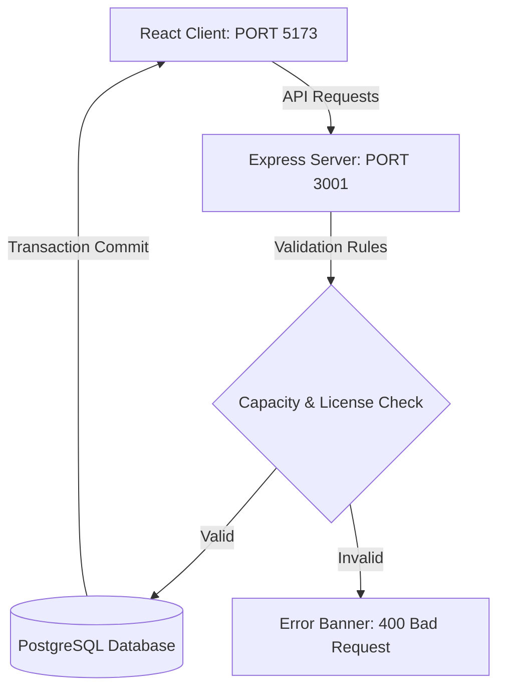

# 🚛 TransitOps – Smart Transport Operations Platform

> **A state-of-the-art public and industrial transport operations platform designed for real-time fleet coordination, resource optimization, and data-driven insights.**

Developed for the **Odoo Hackathon**, TransitOps is a monorepo-based web application that streamlines operational workflows by integrating strict backend validation rules, transactional state safety, and a highly aesthetic, responsive dashboard.

---

## ⚡ Quick Links
- **Branch URL**: [GitHub Branch - Yash](https://github.com/YashPandyaa/TransitOps-Smart-Transport-Operations-Platform/tree/Yash)
- **Frontend URL**: `http://localhost:5173/`
- **Backend API URL**: `http://localhost:3001/`

---

## 🛠️ Tech Stack & Badges


---

## 📌 Table of Contents
1. [Project Overview](#project-overview)
2. [Problem Statement](#problem-statement)
3. [The Solution](#the-solution)
4. [Key Features](#key-features)
5. [System Architecture](#system-architecture)
6. [Folder Structure](#folder-structure)
7. [API Endpoints](#api-endpoints)
8. [Database Schema](#database-schema)
9. [Environment Variables](#environment-variables)
10. [Installation & Setup](#installation--setup)
11. [How to Run the Project](#how-to-run-the-project)
12. [Future Enhancements](#future-enhancements)
13. [Contributors](#contributors)
14. [License](#license)
15. [Acknowledgements](#acknowledgements)

---

## 📖 Project Overview
TransitOps is a transport operations platform built in a tight hackathon timeframe to resolve real-world freight scheduling friction. The application manages **Vehicles, Drivers, and Trips** in an integrated ecosystem. Through atomic transactional logic in PostgreSQL, TransitOps ensures that dispatching operations are strictly validated, preventing resource conflicts, overloaded vehicles, or driving by unlicensed personnel.

---

## 🚨 Problem Statement
Transport operations teams often face:
* **Overloaded Vehicles**: Dispatching cargo that exceeds a vehicle's maximum legal load capacity, risking fines and safety hazards.
* **Unlicensed / Suspended Drivers**: Inadvertently assigning trips to drivers with expired licenses or suspended status.
* **Double Booking / Resource Conflicts**: Scheduling vehicles or drivers that are already on a trip, or vehicles currently in the shop for maintenance.
* **Data Discrepancies**: Delayed or backward odometer logging, making fuel mileage and cost tracking highly inaccurate.

---

## 💡 The Solution
TransitOps resolves these vulnerabilities at the database and application levels:
1. **Pre-dispatch Validation Rules**: Before a trip transitions from *Draft* to *Dispatched*, the system checks that cargo weight is within capacity, the vehicle is available (not retired or in-shop), the driver is available, and their license is active.
2. **ACID Transactions**: State updates for the trip, driver, and vehicle are bound together in a single transaction block. If any validation fails, the entire transaction rolls back.
3. **Interactive UI**: An intuitive dashboard with live status cards, simple dropdown lists querying available resources, and detailed error banners to instantly alert dispatchers of validation rejections.

---

## ✨ Key Features
* **📊 Analytics Dashboard**: High-level counters displaying total trips, active dispatched trips, completed trips, cancelled trips, and total delivered distance.
* **📋 Real-Time Trip Creator**: Form that allows scheduling of trips. The vehicle and driver dropdowns query available assets from the database.
* **🔒 Security & Safety Checks**:
  * Prevents dispatching to drivers with **expired licenses** or **suspended** status.
  * Blocks dispatching of vehicles that are **In Shop** or **Retired**.
  * Validates cargo weight against the vehicle's capacity.
* **✅ Trip Lifecycle Actions**:
  * **Dispatch**: Initiates verification and locks in resources.
  * **Complete**: Opens an input modal to log final odometer readings and fuel consumption, releasing resources.
  * **Cancel**: Cancels the active dispatch and resets resources back to available.

---

## 🏗️ System Architecture



---

## 📂 Folder Structure

<details>
<summary>📂 Click to view directories</summary>

```
TransitOps-Smart-Transport-Operations-Platform/
├── backend/
│   ├── migrations/
│   │   └── 0001_init.sql       # PostgreSQL Initial Schema
│   ├── scripts/
│   │   ├── inspect_db.js       # Database CLI Inspector
│   │   ├── migrate.js         # Migration Runner
│   │   └── setup_db.js         # Database Creator & Initial Seeder
│   ├── src/
│   │   ├── config/
│   │   │   ├── db.js           # pg Connection Pool
│   │   │   └── env.js          # Environment Loader
│   │   ├── middleware/
│   │   │   ├── auth.js         # JWT Authentication Stub
│   │   │   └── errorHandler.js # Global Express Error Handler
│   │   ├── routes/
│   │   │   └── api/
│   │   │       ├── drivers.js  # Drivers GET Route
│   │   │       ├── trips.js    # Core Trips Lifecycle Controller
│   │   │       └── vehicles.js # Vehicles GET Route
│   │   ├── app.js              # Express App setup
│   │   └── index.js            # Server entry point
│   ├── .env.example
│   └── package.json
├── frontend/
│   ├── src/
│   │   ├── App.jsx             # React Core Application View
│   │   ├── index.css           # Custom Glassmorphism Styling
│   │   └── main.jsx            # React Entry Point
│   ├── index.html
│   ├── vite.config.js
│   └── package.json
├── package.json                # Root Concurrently runner
└── README.md
```
</details>

---

## 🔌 API Endpoints

<details>
<summary>🔌 Click to expand routes documentation</summary>

### Trips API (`/api/trips`)
| Method | Endpoint | Description |
| :--- | :--- | :--- |
| `GET` | `/api/trips` | Retrieves all trips with joined vehicle and driver names. |
| `POST` | `/api/trips` | Creates a new trip in `Draft` status. |
| `PUT` | `/api/trips/:id/dispatch` | Dispatches a draft trip (performs safety validation). |
| `PUT | `/api/trips/:id/complete` | Completes an active trip (records odometer & fuel consumed). |
| `PUT` | `/api/trips/:id/cancel` | Cancels a dispatched trip, freeing the resources. |

### Resource APIs
| Method | Endpoint | Description |
| :--- | :--- | :--- |
| `GET` | `/api/vehicles?status=Available` | Retrieves all available vehicles. |
| `GET` | `/api/drivers?available=true` | Retrieves all available drivers with valid licenses. |

</details>

---

## 🗄️ Database Schema
The database runs on PostgreSQL and consists of the following relational tables:
1. **`vehicles`**: Tracks registration, model type, capacity, current odometer, and status (`Available`, `On Trip`, `In Shop`, `Retired`).
2. **`drivers`**: Tracks licensing categories, contact details, license expiry date, safety scores, and status (`Available`, `On Trip`, `Off Duty`, `Suspended`).
3. **`trips`**: Manages source, destination, cargo weight, planned distance, final odometer, fuel used, and status (`Draft`, `Dispatched`, `Completed`, `Cancelled`).
4. **`fuel_logs`**: Logs vehicle refuel history.
5. **`maintenance_logs`**, **`expenses`**, **`users`**.

---

## 🔑 Environment Variables
Create a `.env` file in the `backend/` folder based on [backend/.env.example](file:///d:/TransitOps-Smart-Transport-Operations-Platform-3ebb0e15a120b7ff1f3c0eb113c93d00c54c98f1/TransitOps-Smart-Transport-Operations-Platform/backend/.env.example):

```env
# Server
PORT=3001
CLIENT_ORIGIN=http://localhost:5173

# Postgres Connection Details
PGHOST=localhost
PGPORT=5432
PGDATABASE=transitops
PGUSER=postgres
PGPASSWORD=MyNewPassword123

# Auth Details
JWT_SECRET=dev_secret_change_me
JWT_EXPIRES_IN=7d
```

---

## ⚙️ Installation & Setup

### Prerequisites
* **Node.js 18+** installed.
* **PostgreSQL 17** service running on port 5432.

### Step-by-Step Setup
1. Clone the repository and navigate into it:
   ```bash
   cd TransitOps-Smart-Transport-Operations-Platform
   ```
2. Install dependencies for the workspace, backend, and frontend:
   ```bash
   npm install
   npm install --prefix backend
   npm install --prefix frontend
   ```
3. Setup the backend `.env` file:
   * Copy `backend/.env.example` to `backend/.env`.
   * Open `.env` and verify your local PostgreSQL credentials (specifically `PGPASSWORD`).
4. Initialize the database schema and seed mock data:
   ```bash
   node backend/scripts/setup_db.js
   ```

---

## 🚀 How to Run the Project

To start both the Node/Express backend and the Vite/React frontend concurrently, run:
```bash
npm run dev
```

* **Frontend Dashboard**: Open [http://localhost:5173/](http://localhost:5173/)
* **Backend API**: Running at [http://localhost:3001/](http://localhost:3001/)

---

## 🔮 Future Enhancements
* **AI Route Optimization**: Real-time traffic routing using mapping APIs.
* **Driver Companion App**: Mobile UI for drivers to check in, accept dispatches, and log fuel receipts.
* **IoT Odometer Integration**: Automated odometer logging via vehicle telemetry hardware.
* **Advanced Analytics**: Interactive charts for fuel efficiency trends and vehicle maintenance prediction.

---

## 👥 Contributors
* **Yash Pandya** - [YashPandyaa](https://github.com/YashPandyaa)

---

## 📄 License
This project is licensed under the MIT License - see the LICENSE file for details.

---

## 🤝 Acknowledgements
* Team at **Odoo Hackathon** for hosting the event.
* Open-source community for the Vite, React, Express, and node-postgres libraries.
